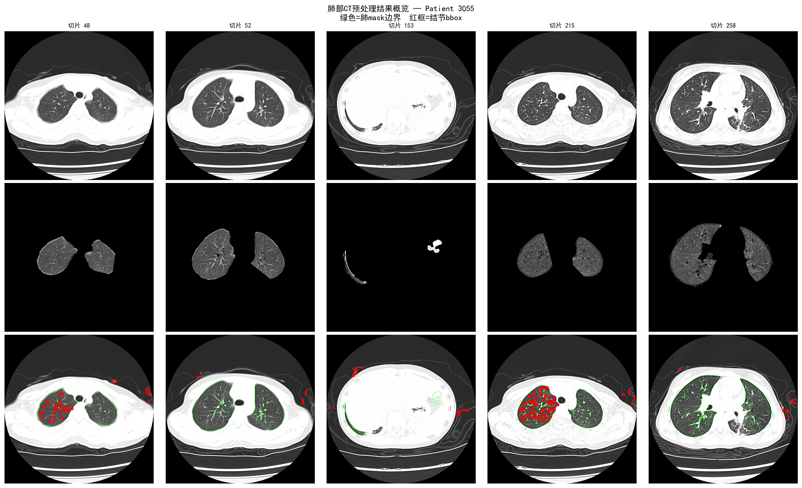
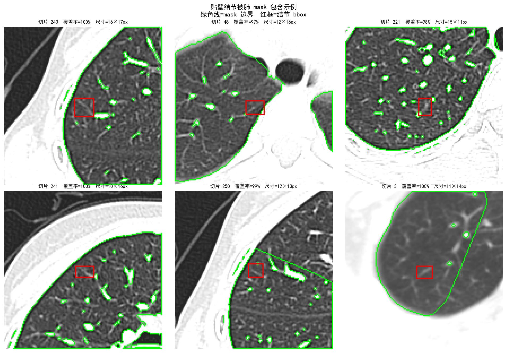

# 肺部CT预处理与结节检测 — Patient 3055

## 项目概述

针对 PNG 格式肺部 CT 序列（273 张切片，512×512，uint8）完成肺实质提取与结节候选检测的完整预处理流程。
**像素值映射关系：**

| 组织类型 | PNG 像素值 | 对应 HU 范围 |
|---------|-----------|------------|
| 背景（扫描野外） | 0 | — |
| 肺内空气 | 37–90 | ≈ −1000–−600 |
| 软组织 | 90–200 | ≈ −600–400 |
| 骨骼 | 200–255 | ≈ 400+ |

---

## 项目结构

```
大数据2301成烨202308010208/
├── lung_extract.py          # 肺实质提取（核心脚本）
├── preprocess_png.py        # 完整预处理流程（凸包膨胀 + 结节标签生成）
├── README.md
└── results/
    ├── result_overview.png        # 整体效果展示（切片 48/52/153/215/258，3行：原图/肺实质/结节检测）
    ├── juxtapleural_nodules.png   # 贴壁结节包含验证（6个典型贴壁结节局部放大，绿色mask边界+红框bbox）
    ├── validated_nodules.npy  # 结节标注（输入，逐切片 2D bbox）
    ├── masks/               # 肺实质提取结果（273 张灰度 PNG，背景=0）
    └── preprocess_out/
        ├── seg_img.npy      # 应用 mask 后的体数据 (273,512,512) uint8
        ├── lung_mask1.npy   # 左肺 mask (273,512,512)
        ├── lung_mask2.npy   # 右肺 mask (273,512,512)
        ├── bboxes.npy       # 3D 结节候选列表（1057 个）
        └── spacing.npy      # 虚拟 spacing [1,1,1]
```

---

## 效果展示

### result_overview.png

5 列对应切片 48、52、153、215、258，3 行分别为：

| 行 | 内容 |
|----|------|
| 第 1 行 | 原始 CT 切片（灰度，uint8） |
| 第 2 行 | 肺实质提取结果（背景=0，肺区保留原始像素值） |
| 第 3 行 | 结节检测叠加图（绿色线=肺 mask 边界，红框=结节 bbox） |



---

### juxtapleural_nodules.png

从 273 张切片中筛选出 6 个典型贴壁结节（juxtapleural nodule），每格为结节中心 ±70px 的局部放大图：

- **绿色线**：肺 mask 边界（`binary_erosion` 求差得到）
- **红框**：结节 bbox（来自 `validated_nodules.npy`）
- 标题显示切片编号、结节在 mask 内的覆盖率（均 ≥ 97%）及 bbox 尺寸

图示验证了凸包 + 5px 膨胀策略能将紧贴胸膜的结节完整包含在肺 mask 内。



---

## 运行方式

```bash
# Step 1：提取肺实质，输出到 results/masks/
python3 lung_extract.py

# Step 2：完整预处理（凸包膨胀 + 结节标签聚合），输出到 results/preprocess_out/
python3 preprocess_png.py
```

---

## 核心算法：肺实质提取（lung_extract.py）

### 整体流程

```
对每张切片 img（512×512 uint8）：
  Step 1  阈值分割，提取空气候选像素（37 ≤ pixel < 90）
  Step 2  连通域分析，排除体外空气和腹部气体
  Step 3  闭运算（r=3px），连接相邻空气区域
  Step 4  binary_fill_holes，填充完整肺轮廓
  Step 5  convex_hull_image，消除肺边缘大凹陷
  Step 6  膨胀（r=5px），向外扩展 mask
  Step 7  排除骨骼（pixel ≥ 200），防止包含肋骨

全局 Pass 2：3D 连续性传播，修复失败切片
```

---

### 关键问题一：如何区分体外空气与肺内空气

体外空气和肺内空气的像素值完全相同（均为 37–90），无法通过阈值直接区分。

**解决策略：连通域边界排除**

对全图空气做连通域分析，凡是触碰图像边界（上/下/左/右任意一边）的连通域，判定为体外空气并排除。肺内空气被胸壁包围，不会直接接触图像边缘。

```python
air = (img >= AIR_LOW) & (img < AIR_HIGH)   # 37 ≤ pixel < 90
lbl, n = ndi.label(air)

for l in range(1, n + 1):
    m = lbl == l
    # 触碰任意边界 → 体外空气，跳过
    if m[0,:].any() or m[-1,:].any() or m[:,0].any() or m[:,-1].any():
        continue
    # 中心行过低（> H×0.6）→ 腹部气体，跳过
    if float(np.where(m)[0].mean()) > H * ROW_RATIO:
        continue
    # 按中线分配到左肺或右肺
    ...
```

同时排除中心行位置偏低（> 图像高度 60%）的连通域，过滤腹部肠道气体。

---

### 关键问题二：如何保证边缘结节被检测到

贴壁结节（juxtapleural nodule）紧贴胸膜，像素值与肺壁相近，若 mask 边界恰好沿肺壁内侧走，结节就会被切掉。本项目采用三层递进策略确保其被包含：

#### 第一层：腐蚀断开气管 + 距离变换分配像素

气管（Trachea）位于纵隔中央，其内部空气像素值与肺内空气完全相同（37–90），纯阈值无法区分。气管通过细支气管与肺相连，直接做连通域分析时三者是一个整体。

**解决策略：形态学腐蚀 + 保留最大两个连通域 + 距离变换**

参考 `references/preprocess.py` 的 `seperate_two_lung()` 思路：

1. 合并所有有效内部空气连通域（排除体外空气和腹部气体）
2. 对合并结果做 5 次腐蚀，细支气管（宽度仅几个像素）率先断开，气管与肺分离
3. 腐蚀后做连通域分析，**只保留面积最大的两个连通域**（左肺 + 右肺），气管作为小连通域被丢弃
4. 用距离变换把原始空气像素分配回最近的肺连通域，恢复腐蚀损失的边界像素

```python
# 腐蚀断开细支气管
eroded = valid_air.copy()
for _ in range(ERODE_ITER):          # ERODE_ITER = 5
    eroded = binary_erosion(eroded)

# 保留最大两个连通域（左右肺），气管被丢弃
lbl_e, n_e = ndi.label(eroded)
sz_e = np.array(ndi.sum(eroded, lbl_e, range(1, n_e + 1)))
top2 = np.argsort(sz_e)[-2:]
comp1 = (lbl_e == (top2[0] + 1))
comp2 = (lbl_e == (top2[1] + 1))

# 距离变换：把 valid_air 中每个像素分配给最近的肺连通域
dist1 = ndi.distance_transform_edt(~comp1)
dist2 = ndi.distance_transform_edt(~comp2)
left_air  = valid_air & (dist1 <= dist2)   # 分配给较近的连通域
right_air = valid_air & (dist1 >  dist2)
```

#### 第二层：凸包填充肺边缘凹陷

心脏压迫、膈肌凹陷等会在肺边缘形成内凹，贴壁结节恰好位于这些凹陷处时会被排除在 mask 外。使用 `skimage.morphology.convex_hull_image` 取精确凸包，将凹陷填平。

为防止两肺合并（左右肺之间的纵隔区域被误填），加入面积增幅限制：**凸包面积 ≤ 原面积 × 1.5 时才替换**。

```python
hull = convex_hull_image(m)
if hull.sum() <= HULL_FACTOR * m.sum():   # HULL_FACTOR = 1.5
    m = hull
```

#### 第三层：向外膨胀 5px

参考 `references/preprocess.py` 的 `convex_hull_dilate(iterations=10)`（3D 膨胀），在 2D 切片上等效为半径 5px 的圆形结构元素膨胀。这使 mask 边界向外扩展约 5 个像素，确保紧贴胸膜的结节被完整包含在 mask 内。

```python
m = binary_dilation(m, structure=disk_se(DILATE_R))   # DILATE_R = 5
```

膨胀后可能将肋骨纳入 mask，因此最后一步排除高密度像素：

```python
m = m & (img < 200)   # 骨骼阈值 200
```

三层策略的效果示意：

```
原始 fill_holes mask：  [  肺空气  ]
                        ↑ 边缘有凹陷，贴壁结节在凹陷处

凸包后：                [   肺空气  ]   ← 凹陷被填平
                         ↑ 结节仍在边界上

膨胀 5px 后：           [    肺空气    ]  ← 边界外扩，结节被包含
```

---

### 关键问题三：3D 连续性保障

在肺尖、气管分叉等层面，肺内空气可能通过薄路径与体外空气连通，导致整个肺空气被误判为体外空气，该切片 mask 面积异常小。

**解决策略：滑动窗口中位数检测 + 多轮传播**

以 ±5 张切片为窗口计算面积中位数，若当前切片面积 < 中位数 × 30%，则用前后最近的正常切片 mask 取并集填补。循环最多 3 轮直到收敛。

```python
for _ in range(3):
    areas = np.array([m.sum() for m in masks])
    for i in range(n):
        win = areas[max(0, i-5):min(n, i+6)]
        win_med = float(np.median(win[win > 0]))
        if areas[i] >= win_med * 0.3:
            continue   # 面积正常，跳过
        # 用前后正常切片填补
        prev = next((j for j in range(i-1,-1,-1) if areas[j] >= win_med*0.3), None)
        nxt  = next((j for j in range(i+1, n)    if areas[j] >= win_med*0.3), None)
        if prev and nxt:
            masks[i] = masks[prev] | masks[nxt]
        ...
```

---

## 输出说明

### results/masks/

273 张灰度 PNG，与原始切片一一对应：
- 背景区域：像素值 = 0
- 肺实质区域：保留原始 CT 像素值（37–199）

非二值图，可直接用于后续结节检测网络的输入。

### results/preprocess_out/

| 文件 | 内容 |
|------|------|
| `seg_img.npy` | 应用 mask 后的体数据，背景填充为 170（软组织均值） |
| `lung_mask1/2.npy` | 左/右肺 bool mask，经凸包膨胀处理 |
| `bboxes.npy` | 1057 个 3D 结节候选，含 `center_zyx`、`diameter`、`z_range` |
| `spacing.npy` | `[1.0, 1.0, 1.0]`，PNG 序列虚拟 spacing |

结节候选由 `preprocess_png.py` 的 `generate_label()` 从逐切片 2D 标注（`validated_nodules.npy`）通过 IoU 匹配聚合为 3D bbox。
