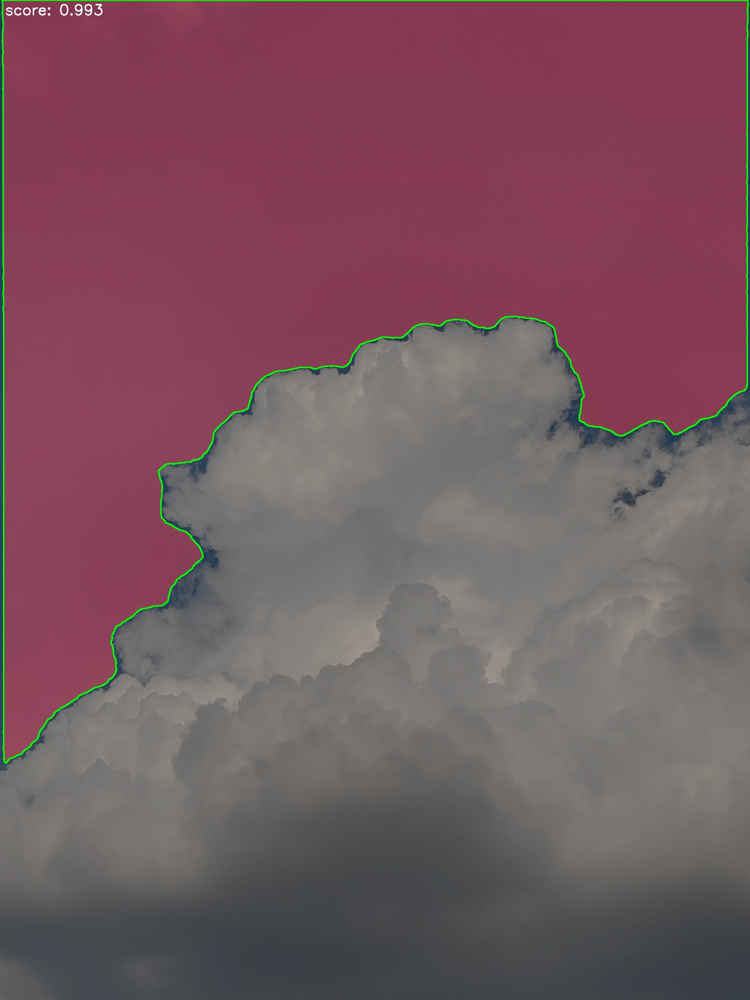

# HNU Digital Image Processing Lab

[](https://www.python.org/)
[](https://opencv.org/)
[](https://riverbankcomputing.com/software/pyqt/)
[](https://numpy.org/)
[](https://github.com/facebookresearch/segment-anything)

This repository collects seven image-processing and computer-vision labs completed for the HNU Digital Image Processing course. Rather than isolated scripts, the later assignments were organized as reusable mini-systems: a PyQt5 image-processing desktop application, frequency-domain visualization, morphology-based OCR, CT lung preprocessing, and Segment Anything based interactive segmentation.

The project is intended to show my practical research-engineering workflow: algorithm implementation, GUI interaction design, medical-image preprocessing, reproducible outputs, and clear documentation.

## Highlights

- Built a layered PyQt5 + OpenCV desktop application with controller, service, core algorithm, and UI modules.
- Implemented classic spatial transforms, histogram operations, artistic filters, frequency-domain filtering, and morphology pipelines from first principles with OpenCV and NumPy.
- Developed a CT lung extraction and nodule candidate preprocessing workflow, including connected-component filtering, convex-hull repair, dilation, and 3D slice-continuity correction.
- Integrated Segment Anything for promptable mask generation and exported masks as visualization, NumPy arrays, and JSON annotations.
- Added result artifacts for visual inspection so the repository can be reviewed directly on GitHub.

## Work Overview

| Folder | Topic | Main Techniques | Output |
| --- | --- | --- | --- |
| `20260324_work1` | Image-processing desktop system | PyQt5, OpenCV, MVC-style layering, asynchronous worker threads | GUI for grayscale, thresholding, transforms, filters, effects, stitching, and optional AI image review |
| `20260326_work2` | Spatial transformation experiments | affine transform, perspective transform, physical scaling, image stitching | transformation scripts and sample image |
| `20260407_work3` | Frequency-domain processing | Fourier transform, low-pass/high-pass filtering, Gaussian smoothing, Laplacian sharpening | GUI and saved spectrum/result images |
| `20260409_work4` | Mathematical morphology | erosion, dilation, opening, closing, structural elements | morphology demo scripts |
| `20260414_work5` | Instrument OCR prototype | template matching, video capture, threaded processing, morphology-based cleanup | OCR system prototype and sample media |
| `20260422_work6` | Lung CT preprocessing | connected components, convex hull, dilation, slice continuity, nodule candidate aggregation | lung masks, preprocessing arrays, overview figures |
| `20260506_work7` | SAM-based segmentation | Segment Anything, mask export, JSON formatting, visualization | promptable segmentation outputs for sample images |

## Representative Results

### Lung CT Preprocessing

`work6` focuses on robust lung parenchyma extraction from a CT slice sequence. The workflow separates inner lung air from external air, repairs boundary concavities with convex hulls, expands the mask to preserve juxtapleural nodules, and propagates valid masks across neighboring slices when a slice-level failure is detected.


### Segment Anything Export

`work7` wraps Segment Anything inference into a small workflow that saves visualization images, binary masks, NumPy arrays, and JSON annotations for downstream processing.



### Frequency-Domain Image Processing

`work3` records both the processed image and its spectrum, making each operation easier to compare and explain.

result.png)

spectrum.png)

## Repository Structure

```text
.
├── 20260324_work1/          # PyQt5 image-processing desktop application
├── 20260326_work2/          # spatial transform scripts
├── 20260407_work3/          # frequency-domain GUI and result images
├── 20260409_work4/          # morphology experiments
├── 20260414_work5/          # instrument OCR prototype
├── 20260422_work6/          # lung CT preprocessing workflow and results
├── 20260506_work7/          # Segment Anything based segmentation workflow
└── README.md
```

## Quick Start

Create an environment and install common dependencies:

```bash
pip install numpy opencv-python pillow matplotlib scipy scikit-image PyQt5
```

Run the main desktop image-processing application:

```bash
cd 20260324_work1
python main.py
```

Run the CT preprocessing examples:

```bash
cd 20260422_work6
python lung_extract.py
python preprocess_png.py
```

Run the SAM segmentation workflow:

```bash
cd 20260506_work7
pip install -r requirements.txt
python main.py --config configs/default.yaml
```

The optional AI image-review feature in `work1` reads credentials from environment variables instead of storing secrets in code:

```bash
set OPENAI_API_KEY=your_api_key
set OPENAI_BASE_URL=https://api.openai.com/v1
set OPENAI_VISION_MODEL=gpt-4o-mini
```

## Notes For Reviewers

- The folders preserve the chronological development of the course labs, while the README highlights the parts most relevant to computer-vision research and engineering.
- Generated Python cache files are intentionally ignored.
- Some large result folders are kept because they make the medical-image and segmentation pipelines reviewable without rerunning every experiment.
